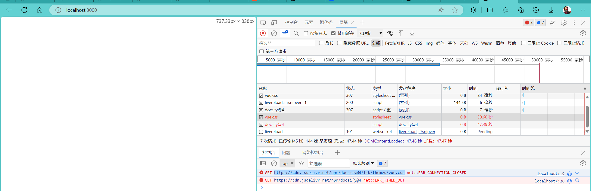

# 这是随便写的标题

> docsify初尝试:
2023-9-2查看八月月刊[HelloGitHub](https://github.com/521xueweihan/HelloGitHub/blob/master/content/HelloGitHub89.md)的时候看到这个项目，觉得挺有趣，就稍微尝试下


## 初始化项目
### 环境

* node 
  * v16.15.0
* npm  
  * 8.5.5


### 终端命令

* npm i docsify-cli -g
* docsify init ./Docsify-Guide
* docsify serve Docsify-Guide
### 遇到问题
F12浏览器终端报错

```
GET https://cdn.jsdelivr.net/npm/docsify@4/lib/themes/vue.css net::ERR\_CONNECTION\_CLOSED

GET https://cdn.jsdelivr.net/npm/docsify@4 net::ERR\_TIMED\_OUT
```



#### 解决方法：改域名

[cdn.jsdelivr.net无法访问的解决方法_Clang的技术博客的博客-CSDN博客](https://blog.csdn.net/u012899618/article/details/124949363)

将cdn.jsdelivr.net域名替换为

* fastly.jsdelivr.net
* gcore.jsdelivr.net

后续在ping的时候发现这仨其实差不多

### 项目部署


## 参考
具体尝试参考文章：

[Docsify使用指南（打造最快捷、最轻量级的个人&amp;团队文档） - 追逐时光者 - 博客园 (cnblogs.com)](https://www.cnblogs.com/Can-daydayup/p/15413267.html)

[Wiki系列（二）：docsify部署及配置 - 知乎 (zhihu.com)](https://zhuanlan.zhihu.com/p/141540641)